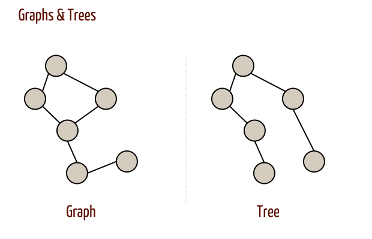
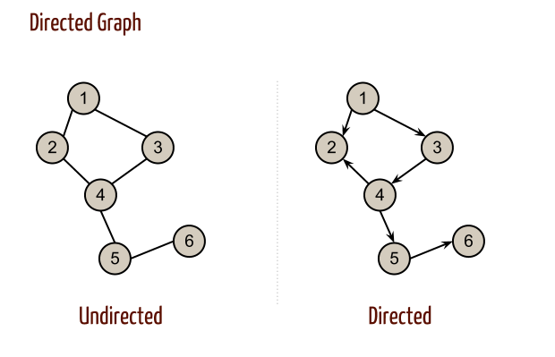
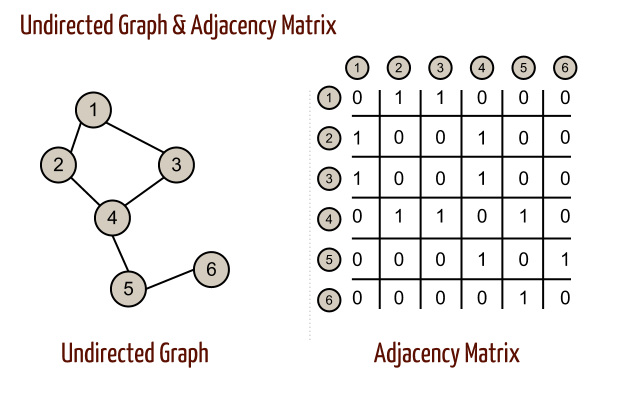
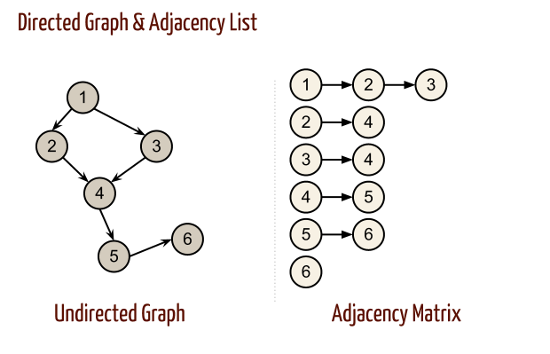

# Knowledge Representation

## Objectives

* Data structures review
* Runtime analysis review
* Knowledge representation meaning
* Graph as data structure
* Homework 1 announcement
* Rational agent
* Knowledge representation/formulating problem

## Metrics/Desired Outcomes

* Complexity analysis (space and/or time)
* Understanding Graph as data structure
* Using graph for general problem solving
* Understand rationality

### Data structures intro

Today, we're going to review all about data structures.

OoohhhhoooOOOhhhh, **soo** exciting? Right?

Yeah, data structures are usually not a fun topic out there, but they are
important. Not just to pass this class, but in order to be a better software
engineer.

For example, knowing data structure can help you to:

* Manage complexity and make your programs easier to follow
* Build high-performance, memory-efficient programs

Using myself at work for example, when I need to improve performance of the
legacy system. I need to do some runtime analysis and its data structure usage.
It is confusing when the legacy program doesn't use any data structure nor
implement any common algorithm or patterns. It's extremely hard to read and
understand thus hard to maintain.

In order to learn about the data structure, we will be going through some
implementation of them together. And you will get to implement the core data
structure -- Graph -- yourself!

### What are data structure?

Data structures are different methods to store and organize data that serve
different requirements.

Depends on what data you have and how you plan to use it, one data structure will
be a better choice than the others.

To understand why, we will be talking about algorithms -- step-by-step sets of
operations to be performed.

You can think of algorithms like formulas to software development in very high
level point of view.

Data structures and algorithms are often implemented together. To implement
algorithm, you will need data structure. And to implement data structure, you
will implement detail in algorithm!

Going back to earlier analogy about algorithms being formulas to software
development, you can think of the data structures as the terms used to abstract
complexity behind.

For example, there are absurd number of algorithms to sort a set of unordered items.

Some of these are faster than others in certain situation. Some use less memory.
Some are easy to implement.

Each one of them are better for *something*. So your job as software engineer is
to make a decision based on what you need. And you will need a way to compare them,
a way to measure them (runtime analysis).

Yay! Our favorite "Big-O" notation will come back to haunt you down after your
CS-312 class before! (Remember the good ol' Master Theorem from final?)

### Big-O Notations

Roughly speaking, Big-O Notation is a way to measure the performance of algorithms
in order to compare one against another when discussing them (or at least for
our purpose).

In summary, Big-O is to classify algorithms by how they perform to number (N)
of items that you give them.

You usually measure two things with Big-O:

* Time complexity
* Space complexity

We measure these two independently because while an algorithm may perform with
less time cost, it may take way more memory!

Recall some common Big-O's:

| Name | Notation | How you feel when they show up at your party |
| :-- | :-- | :-- |
| Constant | O(1) | AWESOME!! |
| Logarithmic | O(log N) | GREAT! |
| Linear | O(N) | Okay. |
| Linearithmic | O(N log N) | Ugh ... |
| Polynomial | O(N ^ 2) | Shitty |
| Exponential | O(2 ^ N) | Horrible |
| Factorial | O(N!) | WTF |

Compare them in a visual way:


So how does Big-O notation help us?

With data structures, you can perform 4 primary types of
actions: Accessing, Searching, Inserting, and Deleting.

It's important for you to note that data structures may be good at one action but bad at other.

| Data structure | Accessing | Searching | Inserting | Deleting |
| :-- | :-- | :-- | :-- | :-- |
| Array | O(1) | O(N) | O(N) | O(N) |
| Linked List | O(N) | O(N) | O(1) | O(1) |
| Binary Search Tree | O(log N) | O(log N) | O(log N) | O(log N) |

Even further, some actions will have a different "average" performance and a "worst case scenario" performance.

There is no silver bullet when choosing data structures, and you can certainly choose one over the other based on the data you are working with and the way you perform with it. This is why it's important to know a number of different common data structures so you can have choices.

### Memory

Memory is pretty boring, it's just bunch of ordered slots where you can store information. You hold onto memory address in order to find information.

Let's imagine a chunk of memory like this:

```
Values:    |1001|1011|1000|0100|1010|0101|0010|0001|1111|0000...
Addresses: 0    1    2    3    4    5    6    7    8    9    ...
```

If you've ever wondered why programming-friendly indexes are zero-indexed, it's because of the way memory works. If you want to read the first chunk of memory, you read from 0 to 1.

Computer memory is a bit like the wild west, every program running on your machine is store within this same *physical* data structure. Without layers of abstraction over it, it would be extremely difficult to use.

The these abstractions serve two additional purposes:

* Store data in memory in a way that is more efficient and/or faster to work with
* Store data in memory in a way that makes it easier to use

From here, we will be going over some basic implementation of data structure. Starting with List, Hash Tables to Graph.

#### List

```js
class List {
  constructor() {
    this.memory = [];
    // we store the length separately because in real life
    // the "memory" doesn't have a length you can read from
    this.length = 0;
  }

  get(address) {
    return this.memory[address];
  }

  push(value) {
    this.memory[this.length] = value;
    this.length ++;
  }

  pop() {
    if (this.length === 0) return;

    var lastAddress = this.length - 1;
    var value = this.memory[lastAddress];
    delete this.memory[lastAddress];
    this.length --;

    return value;
  }

  // push item to beginning of the list
  unshift(value) {
    var previous = value;

    for (var address = 0; address < this.length; address ++) {
      var current = this.memory[address];
      this.memory[address] = previous;
      previous = current;
    }

    this.memory[this.length] = previous;
    this.length++;
  }

  // pop first item out of list
  shift() {
    if (this.length === 0) return;

    var value = this.memory[0];

    for (var address = 0; address < this.length; address ++) {
      this.memory[address] = this.memory[address + 1];
    }

    delete.this.memory[this.length - 1];
    this.length --;
  }

  return value;
}
```

#### Hash table

```js
class HashTable {
  constructor() {
    this.memory = [];
  }

  hashKey(key) {
    var hash = 0;
    for (var index = 0; index < key.length; index ++) {
      var code = key.charCodeAt(index);
      // yay, magic!
      hash = ((hash << 5) - hash) + code | 0;
    }
    return hash;
  }

  get(key) {
    var address = this.hashKey(key);
    return this.memory[address];
  }

  set(key, value) {
    var address = this.hashKey(key);
    this.memory[address] = value;
  }

  remove(key) {
    var address = this.hashKey(key);
    if (this.memory[address]) {
      delete this.memory[address];
    }
  }
}
```

#### Graph

```js
class Graph {
  constructor() {
    // to demonstrate graph, we will be using objected oriented approach
    this.nodes = [];
  }

  addNode(value) {
    this.nodes.push({
      value: value,
      lines: []
    });
  }

  find(value) {
    return this.nodes.find(function(node) {
      return node.value === value;
    });
  }

  addLine(startValue, endValue) {
    var startNode = this.find(startValue);
    var endNode = this.find(endValue);

    if (!startNode || !endNode) {
      throw new Error('Both nodes need to exist');
    }

    startNode.lines.push(endNode);
  }
}
```

Reference on the data structure overview: https://github.com/thejameskyle/itsy-bitsy-data-structures/blob/master/itsy-bitsy-data-structures.js

That is enough of the data structure and why we need to learn them.

### Graph Components

We want to talk about graph and understand the different terminologies of Graph


* Node (Sometimes called Vertex)
* Edge
* Graph

Always, node will hold some values (can be a simple String, Integer, or custom
data). But doesn't matter what data a node is holding, node is node and edge is
edge. And Graph will contain nodes and edges with their relationships.

### Methods

When using graph as data structure, there are some common methods in graph.

* Add/remove node
* Add/remove edge between nodes
* Find node (if there is any)
* Adjacent
* Neighbors
* Distance

### Examples

Why do we need to learn all about Graph again? How is this useful to us?

Graph can be used for many different cases:

* Social network
* Map/city (locations)
* Game States
* More depends on how abstract you can get

### Types of Graphs



Graph has different types such as below:

* Directed/Undirected
  * 
* Weighted
  * 
* Dense/Sparse

> Dense graph: graph has a lot more edges than vertices (defined as `|E| = O(|V|)` where |E| is number of edges and |V| is number of vertices)  
> Sparse graph: graph has relative fewer edges than vertices (defined as `|E| = Θ(|V^2|)`)

### Graph as Abstract Data Structure

Like data structures, within graph as data structure. We also have different
data structure to implement graph and of course different algorithms to implement
each method accordingly.

#### 3 ways to represent graph in programming

There are usually 3 common ways to represent graph internally

1. Adjacency Matrix
  * 
2. Adjacency List
  * 
3. Object Oriented (objects and pointers)

#### Complexity Analysis

Same as data structure, each representation is better at *something*. Best way to
analyze the use case for each representation is by Big-O Notations:

| \ | Adjacency List | Adjacency Matrix | Object Oriented |
| :-- | :-- | :-- | :-- |
| Store graph | O(&#124;V&#124; + &#124;E&#124;) | O(&#124;V&#124;<sup>2</sup>) | Depends |
| Add vertex | O(1) | O(&#124;V&#124;<sup>2</sup>) | Depends |
| Add edge | O(1) | O(1) | Depends |
| Remove vertex | O(&#124;E&#124;) | O(&#124;V&#124;<sup>2</sup>) | Depends |
| Remove edge | O(&#124;E&#124;) | O(1) | Depends |
| Query | O(&#124;V&#124;) | O(1) | Depends |
| Remarks | Slow to remove vertices and edges, because it needs to find all vertices or edges | Slow to add or remove vertices, because matrix must be re-sized/copied | Readable and convenient for OOP(Object Oriented Programming) background users |

Reference: [Wikipedia - Abstract data structure][wiki-graph]

### Rational Agent

We talked about a couple terminologies last week about intelligent agents and
types of environments. Following section will further explain what intelligent
agents are and how they couple with environments.

To recap, an intelligent agent is  about perceiving its environment through
sensors and acting upon that environment through actuators.

An rational agent is the one that does the right thing.

What is right? What is a right thing to do?

We will answer this by considering the *consequences* of agent's behavior. When
agent is plunked down in an environment, it generates a sequence of actions according
to the percepts it receives. If the sequence is desirable, then the agent has
performed well.

The notion of desirability is captured by a **performance measure** that evaluates
any given sequence of environment states.

Noticed that we said *environment* states, not *agent* states. If we define
success in terms of agent's opinion of its own performance, an agent could achieve
perfect rationality simply by deluding itself that its performance was perfect.


Now, it's hard to define a fixed performance measure for all tasks and agents;
typically, a designer will devise one appropriate to the circumstances. As a
general rule, it is better to design performance measures according to what one
actually wants in the environment, rather than according to how one thinks the
agent should behave.

Now back to rational agent, what is considered rational are given on four things:

* The performance measure that defines the criterion of success
* The agent's prior knowledge of the environment
* The actions that agent can perform
* The agent's percept sequence to date

This leads to a definition of a rational agent:

For each possible percept sequence, a rational agent should select an action that
is expected to maximize its performance measure, given the evidence provided by
the percept sequence and whatever built-in knowledge the agent has.

### Omniscience

Rationality and omniscience are different. An omniscience agent knows the actual
outcome of its actions and can act accordingly; but omniscience is impossible
in reality.

In other word, with omniscience agent, you can perform **perfect** sequence of
actions because you know the outcome.

Rational agent, however, maximizes the expected performance, while perfection
maximizes actual performance.

Our definition earlier about rational agent doesn't require omniscience. We must
ensure that we haven't inadvertently allowed the agent to engage in decidedly
underintelligent activities. For example, cross a busy road without looking!

Doing actions in order to modify future percepts -- sometimes called information
gathering -- is important part of rationality.

Our definition of rational agent also requires a rational agent not only to gather
information but also to learn as much as possible from what it perceives. In other
word, agent's initial configuration could reflect some prior knowledge of the
environment, but as the agent gains experience this may be modified and augmented.

To the extent that an agent relies on the prior knowledge of its designer rather
than its own percepts, we say that the agent lacks autonomy. An agent should be
autonomous -- it should learn what it can to compensate for partial or incorrect
prior knowledge.

### Structure of Agents

So far, we talked about the agents by describing its behavior -- the action that
is performed after any given sequence of percepts. Now we must talk about how the
insides work. The job of AI is to design an agent program that implements the agent
function -- the mapping from percepts to actions.

### Agent programs

The agent programs we designed in this class will all be in the same format:

They take the *current* percept as the input from the sensors and return an action
to the actuators.

Noticed that agent program only takes the current precept rathe than the entire
history of percepts -- that is different from agent function.

This agent program could be some sort of table based agent:

```js
function tableBasedAgent(percept) {
  // assume we have a huge look up table on how agent should act according
  // to this hash table
  return lookUpTable[percept];
}
```

Now this table-based agent is doomed to failure. Consider taxi driving, it is
impossible to contain the entire action to percept in a look up table. No physical
storage can allow you to store entire states!

Despite all, table-based agent does do what we want: it implements the desired
agent function. The key challenge for AI is to find out how to write programs that,
to the extent possible, produce rational behavior from a smallish program rather
than from a vast table.

In remainder of this lecture, we will outline four basic kinds of agent programs
that embody the principles underlying almost all intelligent systems:

* Simple reflex agent
* Model-based reflect agent
* Goal-based agents
* Utility-based agents

Simple reflex agent select actions on the basis of the current percept, ignoring
the rest of the percept history. For example, you will hit break when you see the
car in the front breaks.

Simple reflex have the admirable property of being simple, but they turn out to
be limited intelligence. The agent only work if the correct decision can be made
on the basis of only the current percept -- that is, only if the environment is
fully observable.

One can certainly use some randomized move to avoid define all possible rules.
But randomized agent is usually not considered to be rational even though
sometimes it may outperform the sophisticated deterministic agents.

```js
function simpleReflexAgent(percept) {
  // rules is a set of condition-action rules
  var state = interpretInput(percept);
  var rule = ruleMatch(state, rules);
  return rule.ACTION;
}
```

A simple graph to visualize how this agent react to environment would be:

```
Simple Reflex Agent          Environment
+-----------------------+    +----+
|              sensor <-+----+--  |
|                |      |    |    |
|    +-----------+----+ |    |    |
|    | what the world | |    |    |
|    | is like now    | |    |    |
|    +-----------+----+ |    |    |
|                |      |    |    |
|    +-----------+----+ |    |    |
|    | what action I  | |    |    |
|    | should do now  | |    |    |
|    +-----------+----+ |    |    |
|                |      |    |    |
|            actuator --+----+->  |
+-----------------------+    +----+
```

### Model-based reflex agents

To handle partial observability is for the agent to keep track of the part of the
world it cant see now. That is, the agent should maintain some sort of internal
state that depends on the percept history and thereby reflects at least some of the
unobserved aspects of the current state.

To update the internal state information as times goes by requires two kind of
information: some information about how the world evolves independently of the agent
and some information about how the agent's own actions affect the world.

This notion of "how the world works" is called a **model** of the world.

```js
// lets say state, model and rules is stored somewhere before
function modelBasedReflexAgent(percept) {
  // state, current concept of the world state
  // model, a description on how the next state depends on current state and action
  // rules, a set of condition-action rules
  // action, the most recent action, initially none
  state = updateState(state, action, percept, model);
  var rule = ruleMatch(state, rules);
  return rule.ACTION;
}
```

```
Model based Reflex Agent                   Environment
+-------------------------------------+    +----+
|    state <---------+       sensor <-+----+--  |
|                    |         |      |    |    |
|                  +-+---------+----+ |    |    |
| How the world ---+>what the world | |    |    |
| evolves &        | is like now    | |    |    |
| what action I ---+>               | |    |    |
| do               +-----------+----+ |    |    |
|                              |      |    |    |
|                  +-----------+----+ |    |    |
|                  | what action I  | |    |    |
|                  | should do now  | |    |    |
|                  +-----------+----+ |    |    |
|                              |      |    |    |
|                          actuator --+----+->  |
+-------------------------------------+    +----+
```

### Goal-based agents

Knowing something about current state of the environment is not always enough to
decide what to do. The correct decision depends on where goal is. In other word,
as well as a current state description, the agent needs some sort of goal
information that describes situation that are desirable.

The agent program can combine this with the model (the same information as was used
in the model based reflex agent) to choose actions that achieve the goal.

Sometimes the goal can be straightforward. For example, when the goal can be
accomplished in one action. Sometimes it will be more tricky -- for example,
agent needs to consider long sequences of twists and turns in order to find a way
to achieve the goal.

Search and planning are the subfields of AI devoted to finding action sequences
that achieve the agent's goals.

> Note that the action planning here is fundamentally different from the
condition action rules described earlier, in that it involves consideration of the
future.

```
Goal based Agent                           Environment
+-------------------------------------+    +----+
|    state <---------+       sensor <-+----+--  |
|                    |         |      |    |    |
|                  +-+---------+----+ |    |    |
| How the world -+-+>what the world | |    |    |
| evolves &      | | is like now    | |    |    |
| what action I -+-+>               | |    |    |
| do             | +-----------+----+ |    |    |
|                |             |      |    |    |
|                | +-----------+----+ |    |    |
|                +-+>what will be   | |    |    |
|                  | if I do action | |    |    |
|                  +-----------+----+ |    |    |
|                              |      |    |    |
|                  +-----------+----+ |    |    |
|  Goals ----------+>what action I  | |    |    |
|                  | should do now  | |    |    |
|                  +-----------+----+ |    |    |
|                              |      |    |    |
|                          actuator --+----+->  |
+-------------------------------------+    +----+
```

### Utility-based agents

Goals alone are not enough to generate high-quality behavior in most environments.
For example, many action sequences will get the taxi to its destination but some
are quicker, safer, more reliable.

A more general performance measure should allow a comparison of different world
states according to exactly how close they are to goal.

We have already seen that a performance measure assigns a score to any given
sequence of environment states, so it can easily distinguish between more and
less desirable ways of getting to the goal. An agent's utility function is
essentially an internalization of the performance measure.

```
Utility based Agent                        Environment
+-------------------------------------+    +----+
|    state <---------+       sensor <-+----+--  |
|                    |         |      |    |    |
|                  +-+---------+----+ |    |    |
| How the world -+-+>what the world | |    |    |
| evolves &      | | is like now    | |    |    |
| what action I -+-+>               | |    |    |
| do             | +-----------+----+ |    |    |
|                |             |      |    |    |
|                | +-----------+----+ |    |    |
|                +-+>what will be   | |    |    |
|                  | if I do action | |    |    |
|                  +-----------+----+ |    |    |
|                              |      |    |    |
|                  +-----------+----+ |    |    |
|                  | How good I am  | |    |    |
| Utility ---------+>performing in  | |    |    |
|                  | such a state   | |    |    |
|                  +-----------+----+ |    |    |
|                              |      |    |    |
|                  +-----------+----+ |    |    |
|  Goals ----------+>what action I  | |    |    |
|                  | should do now  | |    |    |
|                  +-----------+----+ |    |    |
|                              |      |    |    |
|                          actuator --+----+->  |
+-------------------------------------+    +----+
```

### Learning agents

```
Learning Agent                             Environment

Performance standard
       |
+------+------------------------------+    +----+
|      |        +----------- sensor <-+----+--  |
|   Critic <----+              |      |    |    |
|      |                       |      |    |    |
|      |                       |      |    |    |
|      | feedback              |      |    |    |
|      |                       |      |    |    |
|      |                       |      |    |    |
|      |                       |      |    |    |
|      |  changes  +-----------+----+ |    |    |
|  Learning -------+>Performance    | |    |    |
|  element  <------+ element        | |    |    |
|      | knowledge +-+---------+----+ |    |    |
|  Problem           |         |      |    |    |
|  generator --------+     actuator --+----+->  |
+-------------------------------------+    +----+
```

While utility based agent may be able to generate very rational action but it may
take a lot of work to achieve perfect action. Later on, Tuning (1950) proposed
to build a learning machines and then teach them. In many area of AI, this is now
the preferred method for creating state-of-the-art systems.

### Summary

* An agent is something that perceives and acts in an environment. The agent
function for an agent specifies the action taken by the agent in response to any
percept sequence.
* The performance measure evaluates the behavior of the agent in an environment.
rational agent acts so as to maximize the expected value of the performance measure,
given the percept sequence it has seen so far.
* Environment vary along several significant dimensions. They can be fully or
partially observable, deterministic or stochastic, discrete or continuos
* The agent program implements the agent function. There exists a variety of
basic agent-program designs reflecting the kind of information made explicit and
used in the decision making.
* Simple reflex agents respond directly to percepts, whereas model-based reflex
agents maintain internal state to track aspects of the world that are not
evident in the current percept. Goal-based agents act to achieve their goals, and
utility-based agents try to maximize their own expected "happiness"
* All agents can improve their performance through learning.

### After thought

So how does Graph as data structure comes into the intelligent agents?

One can certain think of Graph as data structure to build the model (for past
and future information). In example, each node will hold the state and each edge
would be an action agent can choose from. Using such model will help the agent
to select the best action.

And an intelligent agent's job is to maximize the performance measure.

From next class, we will start to learn how to use Graph as data structure to
search for best solution.

Our discussion of problem solving begins with precise definitions of problems and
their solutions.

We will beginning by looking at several uniformed search algorithms -- algorithms
that are given no information about problem other than its definitions -- and
informed search algorithms -- given some guidance on where to look for solutions.

### Well-defined problems and solutions

```js
function simpleProblemSolvingAgent(percept) {
  // seq, an action sequence, initiall empty
  var seq = [];
  // state, some description of the current world state
  var state = updateState(state, percept);
  // goal, a goal, initially null
  var goal = null;
  // problem, a problem formulation
  if (!seq) {
    goal = formulateGoal(state);
    problem = formulateProblem(state, goal);
    seq = search(problem);
    if (seq == FAILURE) {
      return null;
    }
  }
  action = seq.pop(); // first item of sequence of actions
  return action;
}
```

A problem can be defined formally by five components:

* The initial state that agent starts in.
* A description of the possible actions available to the agent.
* A description on what each action does; formal name for this is transition model
* The goal test, which determines whether a given state is a goal state.
* A path cost function that assigns a numeric cost to each path.

Together, the initial state, actions, and the transition model implicitly define
the state space of the problem -- the set of all states reachable from the initial
state by any sequence of actions. The state space forms a directed graph in which
the nodes are states and the links between nodes are actions.

And a solution to a problem is an action sequence that leads from the initial state
to a goal state. Solution quality is measured by the path cost function, and an
optimal solution has the lowest path cost among all solutions.

### Formulating problems

To represent any given problem from real world, we have to learn how to abstract
problem into the state space (by removing detail from the representation).

I called this process of formulating problems as knowledge representation.

**Examples**

Lets consider [8-puzzle](http://mypuzzle.org/sliding):

* States: a state description specifies the location of each of the eight tiles
and the blank in the one of the nine squares
* Initial state: Any state can be designated as the initial state.
* Actions: The simplest formulation defines the actions as movements of the blank
space -- LEFT, RIGHT, UP or DOWN.
* Transition model: Given state and action, this returns the resulting state
* Goal test: This checks whether the state matches the goal configuration
* Path cost: Each step would cost 1

## Further Learning

### [Test-Driven-Development][tdd]

1. Write test
2. Fail and cry
3. Fix
4. Rinse and repeat

### [Design Pattern][design-pattern] in action

* Strategy pattern (Representation interface)
* Factory pattern (again Representation interface with static `of` method)

### [Homework 1](homeworks/homework1.md)

[wiki-graph]: https://en.wikipedia.org/wiki/Graph_(abstract_data_type)
[design-pattern]: https://github.com/iluwatar/java-design-patterns
[tdd]: http://agiledata.org/essays/tdd.html
