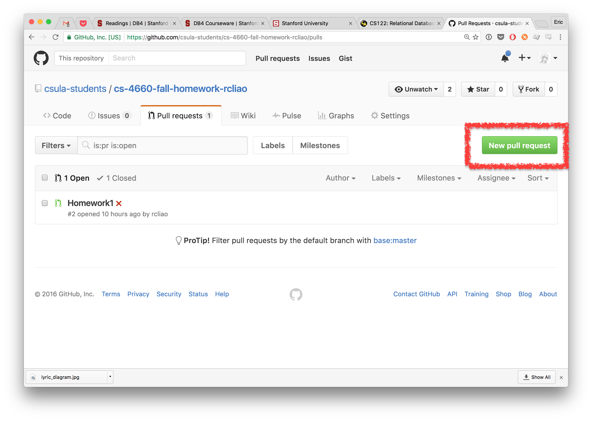
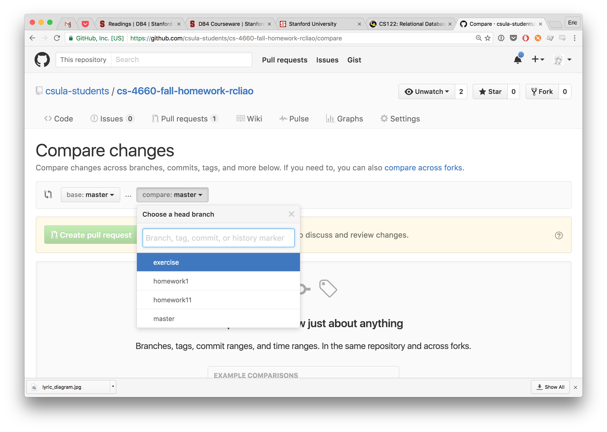

# Homework Submission Guidance

Before you start working on the homework, make sure your local repository is set
up like something below:

```sh
$ git remote -v
origin	git@github.com:csula/cs4660-fall-2016.git (fetch)
origin	git@github.com:csula/cs4660-fall-2016.git (push)
persornal	git@github.com:csula-students/cs-4660-fall-homework-rcliao.git (fetch)
persornal	git@github.com:csula-students/cs-4660-fall-homework-rcliao.git (push)
```

For submitting a homework in CS-4660, you have to follow the following steps to
submit a homework. We will be talking about the steps in high level bullet points
and explain them one by one later in remaining section.

1. Create a **branch** named after homework (like `homework1`) on your local repository
2. Make the necessary coding changes to complete homework
  * Remember to **commit** early and often (as well as pushing early and often)
3. Once you are done with your homework, please create a **pull request** with written
description of what you have accomplished or not accomplished
4. Submit a single file containing the link to the pull request like the following format to CSNS:  
```
https://github.com/csula-students/cs-4660-fall-homework-rcliao/pull/2
```

## Create a new branch

To create a new branch, you can type in `git checkout -b {branchName}`.

After you type in the command above, you should be able to see your branch got
changed to the new branch by typing `git status` like something below:

```sh
$ git status
On branch homework1
Untracked files:
  (use "git add <file>..." to include in what will be committed)

	notes/homeworks/README.md

nothing added to commit but untracked files present (use "git add" to track)
```

## Commit early and often

Once you start making changes, do make sure to commit early and often.

You can commit the changes by `git commit -a` and type in the commit message
in the text editor that is opened (remember to close the text editor when you are
done editing the description of the message).

After commit, you can push your changes by `git push {remote_name} {branch_name}`

> If you set up the local repository like what we did in class it should be something
like `git push personal homework1`

## Create a Pull Request



Click on the above red area to create a new pull request.



And your compare branch should be the branch you made changes of while the base
branch should be master.
