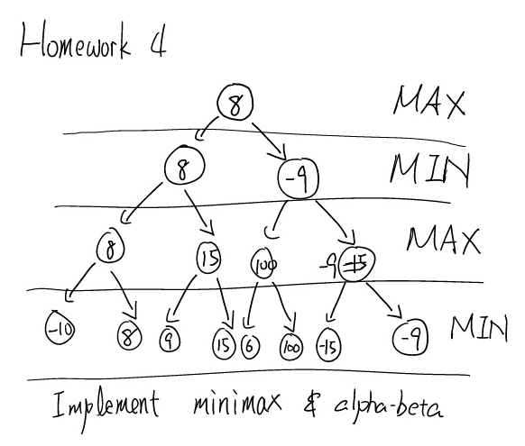
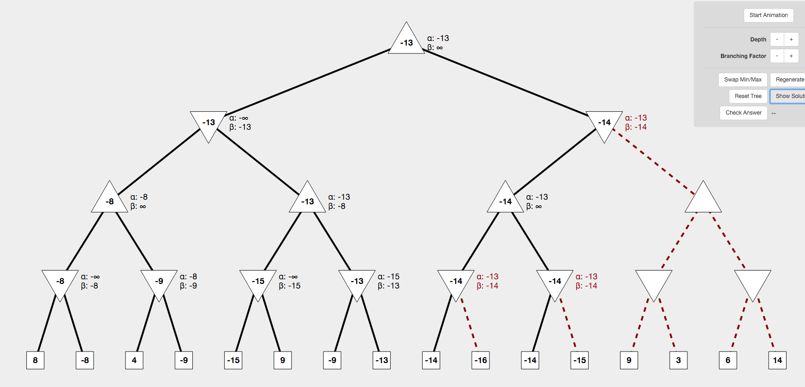

## Important note

Continue from your homework 2 and branch out a `homework-3` branch. And most of all, remember to create a PR as your submission.

## Description

**Minimax & Alpha-Beta**

Your job here is to implement minimax method that will utilize Graph as the data structure before. And in order to find out each node value listed in above graph.

In addition to minimax, you will also need to implement alpha-beta pruning.

## Deliverable

* Github Pull Requests (be sure to pass all unit tests)

:no_entry_sign: DO NOT MODIFY ANY EXISTING TEST CODES :no_entry_sign:

> but you can add more methods and variables as you go

## Grading Rubric

* Pass `MinimaxTest.java` [5 pts]
    * Pass unit tests [3 pts]
    * Coding style and minor details [2 pts]
* Pass `AlphaBetaTest.java` [5 pts]
    * Pass all unit tests [3 pts]
    * Coding style and minor details [2 pts]
    
    
## References

http://inst.eecs.berkeley.edu/~cs61b/fa14/ta-materials/apps/ab_tree_practice/
