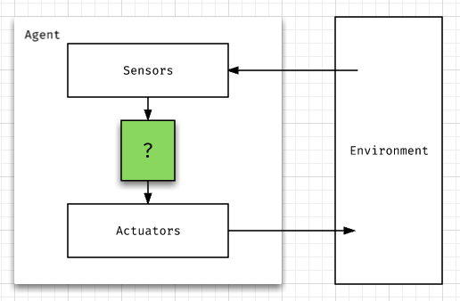

# Introduction

Welcome to introduction to Artificial Intelligence course!

In this course, we will be learning what is AI; specifically, we will learn how
to implement several algorithms.

Before we dive deep into the coding, we want to know what is AI.

## Agenda

* [Syllabus](../SYLLABUS.md)
* Introduction to AI
* Set up environment
    * Wrap up Python exercise

## Metrics

* Concept of Artificial Intelligence
* Environment setup

### Introduction to Artificial Intelligence

#### Definition of Intelligence

Before we talk about Artificial Intelligence, we will need to get the definition
of the Intelligence:

> noun. The ability to acquire and apply knowledge and skills.

We human are very capable of learning and apply knowledge. In fact, this is
usually what we do majority on the first quarter of our life (being students).

And the study of Artificial Intelligence is to understand and implement
intelligence back to machine. This is a huge task! Even to this year, we are
still trying new methods to implement intelligence back to machine!

#### What is Artificial Intelligence?

In order to understand AI better, lets separate the AI into several schools:

There are eight definitions of AI, laid out along two dimensions:

| | Thinking | Acting |
| :-- | :-- | :--
| Humanly | <ul><li>"The exciting new effort to make computers think ... machines with minds, in the full and literal sense" (Haugeland, 1985)</li><li>"[The automation of] activities that we associate with human thinking, activities such as decision-making, problem solving, learning ..." (Bellman, 1978)</li></ul> | <ul><li>"The art of creating machines that perform functions that require intelligence when performed by people." (Kurzweil, 1990)</li><li>"The study of how to make computers do things at which, at the moment, people are better." (Rich and Knight, 1991)</li></ul> |
| Rationally | <ul><li>"The study of mental faculties through the use of computational models." (Charniak and McDermott, 1985)</li><li>"The study of the computations that make it possible to perceive, reason, and act." (Winston, 1992)</li></ul> | <ul><li>"Computational Intelligence is the study of the design of intelligent agents." (Poole et al., 1998)</li><li>"AI ... is concerned with intelligent behavior in artifacts." (Nilsson, 1998)</li></ul> |

> Figure 1.1 from Artificial Intelligence A Modern Approach (3rd edition)

Most well known field comes from "Acting humanly" dimension -- **The Turing Tests**
(proposed by Alan Turing (1950).

The Turing Tests was designed to provide a satisfactory operational definition
of intelligence. It's all about a computer acting like human by a human
interrogator. In specific, human is interacting with computer by asking a
couple questions and computer will try to answer them. At the end of test, this
human will need to judge the other side being human or computer.

The Turing Tests implies that computer would need the following capabilities to
pass the test:

* Natural language processing
* Knowledge representation
* Automated reasoning
* Machine learning
* Computer vision
* Robotics

In which, Alan Turing predicts many of the problems in next 50 years. In other
word, many of the above fields are still actively being studied now.

In this course, we will focus on the "Acting Rationally" to create **the rational
agents** that maximize the chance of success.

#### Rational Agents (Intelligent Agents)

In earlier section, we went over the concept of rational agents as central to
our course. In this section, we will make more concrete explanation to rational
agents. Moreover, we will go over a small set of design principles for building
successful agents -- systems that can reasonably be called intelligent.

An **agent** is anything that makes decisions based on information perceived by
its environment with its *sensors* and use *actuators* to mutate the
environment. An example of the intelligent agent would be *financial agent*.
They can get the stock market information (**sensors**) and use it to make
trades (**actuators**).



The **decisions** it involves between the information from sensors to actions of
actuators is the key of AI.

This entire loop of sensors getting information to making decisions from AI algorithm
and to actions of actuators is often called **Perception-Action cycle**.

*Perception-Action cycle* is what we (Artificial Intelligence developers) are usually
interested of implementing.

In addition, a **rational agent** is the agent that aim to do the *right* thing
given in its condition (what it knows and what not).

#### Omniscience vs Rationality

Doing the right thing. Sounds easy!

In fact, doing the right thing can be hard depending on what environment agent
is in.

For example, lets say Eric want to go across the road. He looks left and right
to ensure there is no car coming. He then decides to walk across the street. At
the moment of Eric crossing the road, lets say there is a trolley car coming at
the speed of 160 miles per hour. And Eric got hit.

Was I wrong for crossing the street? Is it that I'm being an idiot attempts to
cross street?

This example leads back to the definition of rationality:

* The performance measure that defines the criterion of success.
* The agent's prior knowledge of the environment
* The actions that agent can perform
* The agent's percept sequence to date

To above, we have the definition of a rational agent:

> For each possible percept sequence, a rational agent should select an action
> that is expected to maximize its performance measure, given the evidence
> provided by the percept sequence and whatever built-in knowledge the agent has.

Going back to example, we need to know agent may or may not have the full
knowledge of the environment. Given this condition, agent still need to make
choices. A rational agent would say "Hey, this looks like a safe timing to go
across the street!" But the trolley car comes in as accident to hit the agent
as the result may not be predicted by the agent.

**Omniscience**, then, is that agent knows the actual outcome of its actions and
can act accordingly. Rather, you can say "Hindsight is 20/20".

There is a clear difference between Omniscience and Rationality. While rationality
is to maximize the outcome given its condition. Omniscience already know the
result when making choices.

Back to example of trolley car, how do agent make better choice?

Maybe instead of only collecting information before going across the street,
agent can actively continuing looking or hearing from the environment to know
if it is dangerous to cross the street or what not. This is, sometimes, being
referred as **information gathering**.

From the information gathering, agent will need to decide whether to go across
the street or what not again. Sometimes, this decision may require agents to
**learn** about the environment in order to make rational choice.

#### PEAS

Going back to the definition of the rationality, we have a requirement about
performance measure. It's important for us to define the performance measure;
otherwise, we cant measure how well agent is doing.

In designing agents, we usually list PEAS (Performance, Environment, Actuators,
Sensors.) description to design an agent.

| Agent | Performance Measure | Environment | Actuators | Sensors |
| --- | --- | --- | --- | --- |
| Taxi driver | Safe, fast, legal, comfortable trip, maximize profits | Roads, other traffic, pedestrians, customers | Steering, accelerator, brake, signal, horn, display | Cameras, sonar, speedometer, GPS, odometer, accelerometer, engine sensors, keyboard |

#### Environments

The range of environment may affect how you design your agents. We can, however,
simplify the environments down to four types:

* Fully vs partially observables
    * Fully means your agent can fully observe all variables of environment (e.g. chess)
    * Partially observables means your agent can only observe part of the environment (e.g. Starcraft, self-driving car)
* Single vs multiagents
    * single agent may be solving puzzle like crossword
    * multiagents may be agents playing against each other or cooperatively
* Deterministic vs stochastic
    * Deterministic means haves no random effects (like chess -- each moves determines next state deterministically)
    * Stochastic means having some random outcomes (like games involves dices rolling)
* Discrete vs continuous
    * Number of states in games is countable (discrete) and not-countable (continuous)
* Benign vs adversarial
    * Environment goes against you (benign) like Chess (environment -- your opponent -- is trying to defeat you)
    * Or environment is just there (like weather effect for self-driving car)

#### Summary

We will stop here for now before going into the detail of the agents. Lets summarize
what we have learned so far:

* In this course, we are learning how to build **rational agent**
* Rationality is different from Omniscience
* Use PEAS to help designing your agent
* Based on what environment your agent is in, you may have dramatically different  
requirement sets

#### Recommended reading

* https://en.wikipedia.org/wiki/Intelligent_agent
* Artificial Intelligence A Modern Approach Chapter 1 and 2

### Environment setup

The second half of class will be diving into the environment set up!

* Follow the note to set up Python -- https://github.com/csula/Utilities/blob/master/setups/python-setup.md
* And follow the note to set up Git/Github -- https://github.com/csula/Utilities/blob/master/setups/git-github-notes.md

### Wrap Up Python Exercise

Once you set up the above two dependencies, please do this wrap up exercise to
test your local environment setup!

Since not everyone has experience of using Github/Git before, we will go over
in class exercise to demonstrate how you should submit your assignment in future.

The goal of this exercise is to review mainly three concepts (File IO,
Object Oriented Programming & Test Driven Development).

You may start reading through the source code folder `cs4660` for the starting
point of the exercise.

To get the code:

1. Fork/clone course repository
2. Code, pass unit test & commit  
> Note 1: You can run `python -m unittest discover` to check if you passed the provided unit tests right away locally
> Note 2: DO NOT MODIFY ANY EXISTING TEST CODES

3. Pull request & review comments  
> Note that in the pull request, you will see the build result immediately in the pull request status. Please make sure you at least pass the unit tests as they are one of the grading criteria.

If you have trouble pushing to your own repository under your workspace

```bash
git remote set-url origin {Your repository url} # https://github.com/csula/cs4660-fall-2017-exercise-1-rcliao.git for example
git commit -a # will open text editor for you to enter commit message
git push # push to origin server (which will be your repository)
```

Click here to set your repository -- https://classroom.github.com/a/5llmpWhz

1. Push your code to that repository.
2. Paste link to CSNS "Your repository" section

