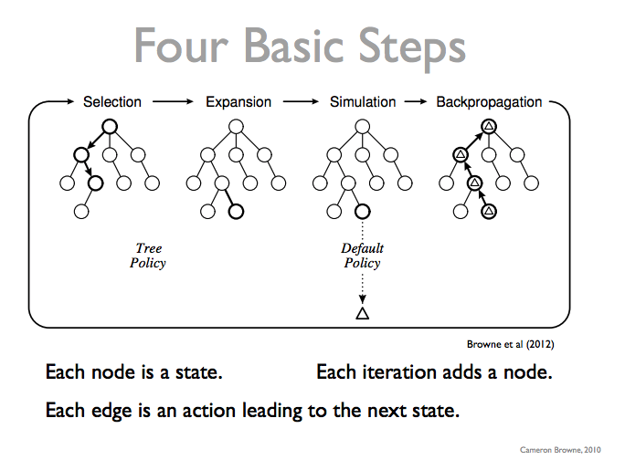
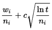
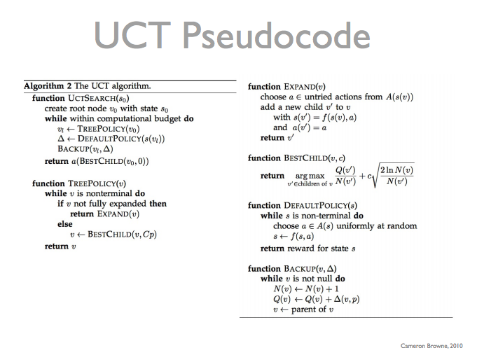

# Monte Carlo Algorithm

Reference: http://www.xkcd.com/1002/

Previously, we have learned how Minimax works and how to use Alpha-beta pruning
algorithm to improve the performance of Minimax. You should know how expensive
Minimax algorithm can be.

In addition, we are facing an issue while implementing the evaluation function.
In other word, we have to do heuristic (a guess) value of the non-terminal state.

Moreover, in the project where you have the runtime limit, how does your programming
agent know how many depth of minimax to explore?

In this section, we will be looking into an alternative approach on probablistic
analysis of game trees. Furthermore, we will examine an approach based on Monte
Carlo game simulation.

## Monte Carlo Search

> The basic idea for Monte Carlo search is simple. In order to estimate the non-terminal
state, we make some probes from that state to the end of the game by selecting 
random moves for the players. We sum up the total reward for all such probes and 
divide by the number of probes to obtain an estimated utility for that state. 
We can then use these expected utilities in comparing states and selecting actions.

Reference: http://logic.stanford.edu/ggp/chapters/chapter_08.html

**Example tree**

Monte Carlo Search involves two phases:

* Exploration
* Propagation

In the exploration phase, Monte Carlo search algorithm will random select a node
and go down the tree to either certain depth or terminal state.

In the propagation phase, Monte Carlo search algorithm then will call evaluatie
function up the tree.

Then the value of each upper level nodes will take the sum of values divided by 
the number of child nodes (that is being evaluated).

As the result of Monte Carlo search algorithm, it generates a probability of each
child node based on its random exploration.

## Pros and cons

With this random exploration approach, there are certainly some pros and cons of
this approach.

One of the pros for the Monte Carlo algorithm is to be used by general game playing
as it doesn't care about how the game is being played. Or it can be used by a very
complex game where agent cannot possible explore the entire state tree like Go.

The downside about Monte Carlo search algorithm is that it can be optimistic.
It assumes players all uses random moves that all players doesn't know how
to play the game in fact that some player may know how to play the game. For example,
it doesn't help when most child state goes to win but there is an immediate losing
case and other player sees it.

## Monte Carlo Tree Search

Monte Carlo Tree search involves 4 phases:

Reference: http://ccg.doc.gold.ac.uk/teaching/ludic_computing/ludic16.pdf

### 4 Steps of MCTS

* Selection: start from root R and select successive child nodes down to a leaf node L. The section below says more about a way of choosing child nodes that lets the game tree expand towards most promising moves, which is the essence of Monte Carlo tree search.
* Expansion: unless L ends the game with a win/loss for either player, either create one or more child nodes or choose from them node C.
* Simulation: play a random playout from node C.
* Backpropagation: use the result of the playout to update information in the nodes on the path from C to R.

### Challenge of MCTS

One of the biggest challenge of MCTS is to select the most important node in the selection phase.

And the formula to select most important node is as below:

* wi stands for the number of wins after the i-th move;
* ni stands for the number of simulations after the i-th move;
* c is the exploration parameter—theoretically equal to √2; in practice usually chosen empirically;
* t stands for the total number of simulations for the node considered. It is equal to the sum of all the ni.

### Algorithm

