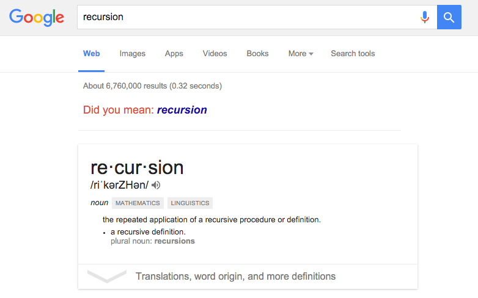

# Problem searching

## Objectives

* Homework 1 Q&A
* Recap of Graph
* DFS (Depth First Search)
* Recursion Review
* BFS (Breadth First Search)

## Metrics/Desired Outcomes

* Understanding BFS/DFS
* Able to implement BFS/DFS

### Recap of Graph

* Graph
* Node
* Edge

> Graph is an abstract data structure you can use to traverse and reason behind
certain problem.

### Examples

* Map
* Maze
* Game Tree
* http://visualgo.net/dfsbfs.html
* http://qiao.github.io/PathFinding.js/visual/

> We have data now, how do we process it to produce a useful output?

### Searching for solutions

Having formulated some problems, we now need to solve them. A solution is an
action sequence, so search algorithms work by considering various possible action
sequences. The possible action sequences starting at the initial state form a
search tree with the initial state at the root; the branches are actions and the
nodes correspond to states in the state space of the problem.

Note that the state tree may or may not be seen as whole static tree at the
beginning. This implies sometimes you will need to expand the current state; that
is, applying each legal action to the current state, thereby generating a new set
of states.

This is the essence of search -- following one option now and putting the other
aside for later, in case the first choice does not lead to a solution.

Consider the Graph structure we formed from the Map, nodes without children in the
tree are called leaf node or frontier. (some called this as open list).

The process of expanding nodes on the frontier continues until either a solution is found or there are no more states to expand. The process of choose state to expand next -- the so-called **search strategy**.

**Repeated paths** if not handle correctly will cause your problem search algorithm
to end up with going back and forth in the same states. And often your search
strategy needs to do something to avoid them.

We will talk about a general GraphSearch method below with handling repeated paths
handling:

```js
// return a solution (action sequence) or failure
function GraphSearch(problem) {
  // initialize frontier using the initial state of the problem
  var initialState = problem.initialState;
  var frontier = neighbors(initialState);
  // initialize the explored set to be empty to avoid repeat path
  // or sometimes called closed set
  var exploredSet = [];

  while (frontier.length) {
    // choose a leaf node and remove it from the frontier
    var node = getRandomNode(frontier);
    // if the node contains a goal state then return the corresponding solution
    if (isGoal(node)) {
      return solution;
    }
    // add node to the explored set
    exploredSet.push(node);
    // expand the node, adding the resulting nodes to the frontier
    // only if not in the frontier or explored set to avoid repeat path
    var possibleNextStates = expand(node);
    possibleNextStates.forEach(n => {
      if (!frontier.contains(n) && exploredSet.contains(n)) {
        frontier.push(n);
      }
    });
  }

  // otherwise, we cannot find a possible solution, return a failure
  return false;
}
```

To continue the example, we will be finding a path in the rectangular grid later.
You will be coding a path finding algorithm at the end of class :D!

### Infrastructure for search algorithm

Search algorithms require a data structure to keep track of the search tree that
is being constructed. For each node n of the tree, we have a structure that contains
four components:

* n.state: the state in the state space to which the node corresponds
* n.parent: the node in the search tree that generated this node
* n.action: the action that was applied to the parent to generate the node
* n.path-cost: the cost, traditionally denoted by g(n), of the path from the
initial state to the node, as indicated by the parent pointers.

Therefore, giving a parent node, to find possible child nodes with the infrastructure
of search algorithm above:

```js
function childNode(problem, parent, action) {
  // return a child node after applying action to parent node with 4 components
  return node.setState(problem.result(parent.state, action))
    .setParent(parent)
    .setAction(action)
    .setPathCost(parent.pathCost + problem.stepCost(parent.state, action));
}
```

Now we have nodes, we will need to put them into frontier somehow. To do so, we
will need to pick and choose some data structure for frontier to store. The
appropriate data structure for frontier is a queue.

Now, here is a homework for you, review queue, stack and priority queue (on how
they work and how to implement them in Java). As you will need those data structure
in most of the algorithms we implement later.

### Measuring problem-solving performance

Before we go into the design of any search algorithm, we will need to consider the
criteria that might be used to choose among them. We can evaluate an algorithm's
performance in following four ways:

* Completeness: is algorithm guaranteed to find a solution when there is one?
* Optimality: does the strategy find the optimal solution?
* Time complexity: how long does it take to find a solution?
* Space complexity: how much memory is needed to perform the search.

### Uninformed Search Strategies

The following sections will cover both common uninformed search algorithm, also
called blind search(BFS & DFS). The term means that the strategies have no
additional information about the states beyond the provided in the problem definition.

On the other hand, strategies that know whether one non-goal state is "more promising"
than another is called informed search or heuristic search strategies, which
we will cover later.

### Depth First Search (DFS)


#### Pseudocode

```javascript
// accumlator, return, stacks

DFS(startNode);

function DFS(current) {
  return DFS(current, {});
}

function DFS(current, parents) {
  for (child in chilren) {
    if (child.isDiscovered) {
      continue;
    }
    child.isDiscovered = true;
    parents.put(current, child);
    DFS(child, parents);
  }
}
```
### Recursion Review



* Base case
* Induction

## Breadth First Search (BFS)


### Pseudocode

```javascript
function BFS(v) {
    for (node in G) {
        node.distance = Number.MAX_VALUE;
        node.parent = null;
    }

    // create empty queue Q
    var queue = new Queue();
    // Best first search - use priority queue (lowest number goes first)
    var result = [];
    var endTile = null;

    v.distance = 0;
    queue.enqueue(v);

    while (!queue.isEmpty()) {
        var u = queue.dequeue();

        for (node in Graph.neighbors(u)) {
            if (node.distance == Number.MAX_VALUE) {
                node.distance = u.distance + edge.value
                // note that I'm leaving edge value up to
                // you to implement
                node.parent = u;
                if (Graph.isGoal(node)) {
                  endTile = u;
                }
                queue.enqueue(node);
            }
        }
    }
    // back trace from goal to start
    while (endTile.parent != null) {
      result.add(Edge(endTile.parent, endTile));
      endTile = endTile.parent;
    }
    // remember to reverse the result before return
    return result.reverse();
}
```

## Learning

1. Solve https://www.hackerrank.com/challenges/saveprincess
2. ~~Implement Game interface~~

> Due to time constraint, I decide to remove the game interface as part of learning from this class; we will talk about it when I talk about Dijkstra algorithm. Stay Tuned!
